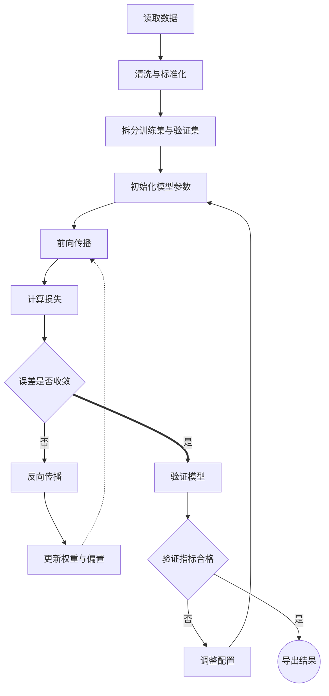

# md any where 复杂公式与流程图示例

> 这份文档用于测试 Markdown 排版、LaTeX 数学公式、中英文混排和 Mermaid 流程图。公式的概念并不艰深，复杂度主要来自符号、上下标、矩阵与多行对齐。

## 1. 文档概览

| 内容 | 示例 | 用途 |
| --- | --- | --- |
| 行内公式 | $E=mc^2$ | 在普通段落中插入简短符号 |
| 分式与根式 | $x=\frac{-b\pm\sqrt{b^2-4ac}}{2a}$ | 检查线条和层级排版 |
| 矩阵 | $\mathbf{A}\in\mathbb{R}^{m\times n}$ | 检查粗体、黑板体和上标 |
| 流程图 | `flowchart LR` | 检查节点、分支、标签和循环 |

### 验收清单

- [x] 标题、列表、引用和表格
- [x] 行内公式与块级公式
- [x] 矩阵、分段函数和多行对齐
- [x] Mermaid 流程图
- [ ] 导出 Word / WPS 后检查公式是否仍可编辑

## 2. 常见符号的组合排版

设有一组观测数据 $\mathcal{D}=\{(\mathbf{x}_i,y_i)\}_{i=1}^{N}$，其中 $\mathbf{x}_i\in\mathbb{R}^{d}$。向量长度、内积与平均值可以同时写成：

$$
\left\lVert \mathbf{x}_i \right\rVert_2
=\sqrt{\sum_{j=1}^{d}x_{ij}^{,2}},
\qquad
\langle\mathbf{x}_i,\mathbf{w}\rangle
=\mathbf{x}_i^{\mathsf T}\mathbf{w},
\qquad
\bar{\mathbf{x}}
=\frac{1}{N}\sum_{i=1}^{N}\mathbf{x}_i.
$$

下面的式子只是“先求和，再取平均”，但同时展示了极限、期望、条件与指示函数：

$$
\widehat{\mu}_{N}
=\frac{1}{N}\sum_{i=1}^{N}X_i
\xrightarrow[N\to\infty]{\text{a.s.}}
\mathbb{E}\!\left[X\mid X>0\right],
\qquad
\mathbf{1}_{\{X>0\}}
=
\begin{cases}
1, & X>0,\\
0, & X\le 0.
\end{cases}
$$

## 3. 多行对齐：一次简单的参数更新

对于线性预测 $\widehat{\mathbf{y}}=\mathbf{X}\mathbf{w}+b\mathbf{1}$，平均平方误差及其更新可排成对齐的推导链：

$$
\begin{aligned}
\mathcal{L}(\mathbf{w},b)
  &=\frac{1}{2N}\left\lVert\mathbf{X}\mathbf{w}+b\mathbf{1}-\mathbf{y}\right\rVert_2^2
    +\frac{\lambda}{2}\left\lVert\mathbf{w}\right\rVert_2^2,\\[4pt]
\nabla_{\mathbf{w}}\mathcal{L}
  &=\frac{1}{N}\mathbf{X}^{\mathsf T}
    \left(\mathbf{X}\mathbf{w}+b\mathbf{1}-\mathbf{y}\right)
    +\lambda\mathbf{w},\\[4pt]
\frac{\partial\mathcal{L}}{\partial b}
  &=\frac{1}{N}\mathbf{1}^{\mathsf T}
    \left(\mathbf{X}\mathbf{w}+b\mathbf{1}-\mathbf{y}\right),\\[4pt]
\mathbf{w}^{(t+1)}
  &=\mathbf{w}^{(t)}-\eta_t\nabla_{\mathbf{w}}\mathcal{L},
  &
b^{(t+1)}
  &=b^{(t)}-\eta_t\frac{\partial\mathcal{L}}{\partial b}.
\end{aligned}
$$

其中，$\eta_t>0$ 是第 $t$ 步的学习率，$\lambda\ge 0$ 是正则化强度。

## 4. 矩阵、上下标与带括号的复合结构

一个两层网络的前向传播可以写成：

$$
\begin{gathered}
\mathbf{Z}^{(1)}=\mathbf{W}^{(1)}\mathbf{X}+\mathbf{b}^{(1)}\mathbf{1}^{\mathsf T},
\qquad
\mathbf{A}^{(1)}=\sigma\!\left(\mathbf{Z}^{(1)}\right),\\[4pt]
\mathbf{Z}^{(2)}=\mathbf{W}^{(2)}\mathbf{A}^{(1)}+\mathbf{b}^{(2)}\mathbf{1}^{\mathsf T},
\qquad
\widehat{\mathbf{Y}}=\operatorname{softmax}\!\left(\mathbf{Z}^{(2)}\right),\\[4pt]
\operatorname{softmax}(\mathbf{z})_k
=\frac{\exp(z_k-\max_j z_j)}
{\displaystyle\sum_{r=1}^{K}\exp(z_r-\max_j z_j)}.
\end{gathered}
$$

反向传播的链式法则可以紧凑地写成：

$$
\boxed{
\frac{\partial\mathcal{L}}{\partial\mathbf{W}^{(\ell)}}
=
\underbrace{
\frac{\partial\mathcal{L}}{\partial\mathbf{Z}^{(\ell)}}
}_{\boldsymbol{\delta}^{(\ell)}}
\left(\mathbf{A}^{(\ell-1)}\right)^{\mathsf T}
}
\qquad
\text{and}
\qquad
\boldsymbol{\delta}^{(\ell-1)}
=
\left(\mathbf{W}^{(\ell)}\right)^{\mathsf T}
\boldsymbol{\delta}^{(\ell)}
\odot
\sigma'\!\left(\mathbf{Z}^{(\ell-1)}\right).
$$

## 5. 分段函数和带条件的记号

下面的激活函数只表示“负数变成小斜率，正数保持不变”：

$$
\operatorname{LeakyReLU}_{\alpha}(x)
=
\begin{cases}
x, & x\ge 0,\\[2pt]
\alpha x, & x<0,
\end{cases}
\qquad
\frac{\mathrm d}{\mathrm dx}\operatorname{LeakyReLU}_{\alpha}(x)
=
\begin{cases}
1, & x>0,\\[2pt]
\alpha, & x<0.
\end{cases}
$$

若需同时展示集合、交并、子集和逻辑符号，可以使用：

$$
\Omega=\left\{\theta\in\mathbb{R}^{p}
\;\middle|\;
\lVert\theta\rVert_1\le\tau
\;\land\;
\theta_j\ne 0\ \forall j\in S
\right\},
\qquad
S\subseteq\{1,2,\ldots,p\},
\qquad
\Omega_1\cap\Omega_2\ne\varnothing.
$$

## 6. 从数据到结果的流程图

## 7. 简短结论

1. Markdown 负责文档结构，LaTeX 负责精确的数学排版。
2. 即使公式意义简单，也可以通过 $\underbrace{\cdots}_{\text{说明}}$、$\boxed{\cdots}$、矩阵、分段函数和多行对齐呈现专业效果。
3. Mermaid 负责表达顺序、判断、回路和结束状态，适合研究方法、实验流程与审稿步骤。

---

*Generated as a visual acceptance document for md any where 1.0.0.*
